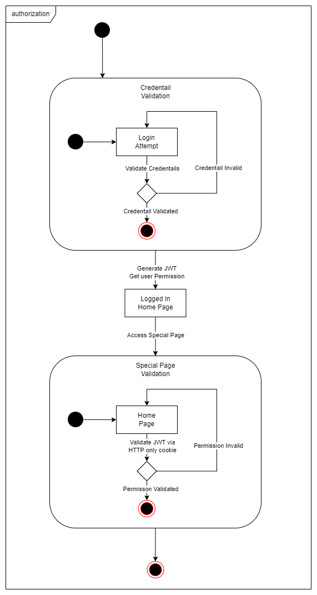

# GX Nuxt Portfolio

This is a portfolio repository regarding [Nuxt 3](https://nuxt.com/), based on the [Vue 3](https://vuejs.org/) framework. It contains multiple projects under the [Nx](https://nx.dev/) monorepo structure.

## Table of Contents

- [Cinemate](#cinemate)
  - [Development](#development)
  - [Deployment](#deployment)
- [Shopiverse](#shopiverse)
- [Nuxt JWT](#nuxt-jwt)

## Cinemate

A movie database application that allows users to search for movies, view movie details.

### Development

Please use PNPM as the package manager for this project.

```bash
npm install -g pnpm
```

To install the dependencies, use the following command:

```bash
pnpm install
```

To run the project, use the following command:

```bash
pnpm run dev:cinemate
```

### Deployment

```bash
pnpm run build-cinemate
```

## Shopiverse

To add a database, please use the following commands:

```bash
nx run shopiverse:prisma-generate
```

```bash
nx run shopiverse:prisma-migrate
```

The `migrations` directory will be created and database tables will be created.

After data insertion, run the following command to look into the database:

```bash
nx run shopiverse:prisma-studio
```

The Prisma Studio will be opened in the browser with `http://localhost:5555`.

- TODO: account address insertion when users register with Supabase triggers.
- TODO: checkout, and payment functionality.
- TODO: SQL to reference Users and Products.
- TODO: SQL to reference Orders and OrderItems.

## Nuxt JWT

### Authorization Flow with JWT

This project implements a JWT-based authentication and authorization system. The flow is designed to manage user access to a home page and a special page with additional permissions.

### Table of Contents

- [Requirements](#requirements)
- [Pre-requisites](#pre-requisites)
- [Installation](#installation)
- [Usage](#usage)
- [Technology Stack](#technology-stack)
- [Project Structure](#project-structure)
- [State Machine Overview](#state-machine-overview)
- [Key States and Transitions](#key-states-and-transitions)
- [HttpOnly Cookie](#httponly-cookie)
- [Security Benefits](#security-benefits)
- [Limitations](#limitations)
- [Best Practices](#best-practices)

### Requirements

- Simulated generation of "secretphrase.txt" file
- Secure storage and retrieval of secret phrases
- Authentication process using the secret phrase
- Access control for special pages

### Pre-requisites

- Node.js (version 18.x or higher); The project uses v22.8.0
- pnpm (version 9.10.0)
- .env file at the root directory with the following content:

```.env
JWT_SECRET=secretPhrase
```

Otherwise, it uses `secretPhrase` as the default secret phrase.

### Installation

If you haven't had the pnpm installed, you can install it by running the following command:

```bash
npm install -g pnpm
```

Then,

```bash
pnpm install
```

### Usage

```bash
pnpm run start
```

### Technology Stack

- NuxtJS: A powerful Vue.js framework for building modern web applications
- NuxtUI: A UI library for Nuxt applications
- TypeScript: Adds static typing to enhance code quality and developer experience
- Pinia: State management for Vue applications

### Project Structure

The project follows the Nx monorepo structure for better scalability and maintainability. This approach offers:

1. Consistent development experience across the project
2. Automated dependency management
3. TypeScript support with auto-generated configuration files

### State Machine Overview



### Key States and Transitions

1. **Credential Validation**

   - **Login Attempt**: Users provide credentials to log in.
   - **Validate Credentials**: The system checks the provided credentials.
     - **Credential Invalid**: If credentials are incorrect, access is denied.
     - **Credential Validated**: If credentials are correct, proceed to generate a JWT.

2. **JWT Generation**

   - **Generate JWT**: A JWT is created for the authenticated user, including user permissions.
   - **Logged In**: The user is now authenticated and can access the home page.

3. **Home Page Access**

   - Users with a valid JWT can access the home page without additional checks.

4. **Special Page Validation**
   - **Access Special Page**: Users attempt to access a page requiring special permissions.
   - **Validate JWT via HTTP-only Cookie**: The system checks the JWT for necessary permissions.
     - **Permission Invalid**: If permissions are insufficient, access is denied.
     - **Permission Validated**: If permissions are valid, access to the special page is granted.

### HttpOnly Cookie

HTTP-only cookies are a security feature designed to help protect against cross-site scripting (XSS) attacks.

### Key Points:

1. **Definition**: An HTTP-only cookie is a cookie that cannot be accessed by client-side scripts, such as JavaScript.

2. **Purpose**: The main purpose of HTTP-only cookies is to mitigate the risk of client-side script accessing protected cookie data.

3. **Implementation**: The HTTP-only flag is set in the Set-Cookie HTTP response header when creating a cookie.

4. **Browser Support**: Most modern web browsers support HTTP-only cookies.

5. **Access Restriction**: HTTP-only cookies are only accessible by the server, not by client-side code like JavaScript.

6. **Common Use**: They are typically used for sensitive data like session tokens or authentication tokens.

### How it Works:

- When a cookie is set with the HTTP-only flag, it includes an additional attribute in the Set-Cookie header.
- The syntax looks like this: `Set-Cookie: <name>=<value>[; <Max-Age>=<age>][; expires=<date>][; domain=<domain_name>][; path=<some_path>][; secure][; HttpOnly]`. Here is the actual implementation:

```typescript
import { setCookie } from 'h3';
setCookie(event, 'auth_token', token, {
  httpOnly: true,
  secure: process.env.NODE_ENV === 'production', // send it with HTTPS only in production
  maxAge: 60 * 60 * 24 * 7, // 1 week
  path: '/'
});
```

And within the browser conosle, `useCookie('auth_token')` won't be able to access the cookie.

### Security Benefits:

- Protects against certain types of XSS attacks by preventing client-side scripts from accessing the cookie.
- Even if a cross-site scripting flaw exists, the browser will not reveal an HTTP-only cookie to a third party.

### Limitations:

- While HTTP-only cookies provide an additional layer of security, they don't prevent all types of attacks.
- They should be used in conjunction with other security measures for comprehensive protection.

### Best Practices:

- Use HTTP-only for cookies containing sensitive information, especially session tokens.
- Combine with the 'Secure' flag to ensure the cookie is only transmitted over HTTPS.

In summary, HTTP-only cookies are a valuable security feature that helps protect sensitive cookie data from being accessed by client-side scripts, thereby reducing the risk of certain types of attacks, particularly cross-site scripting.
